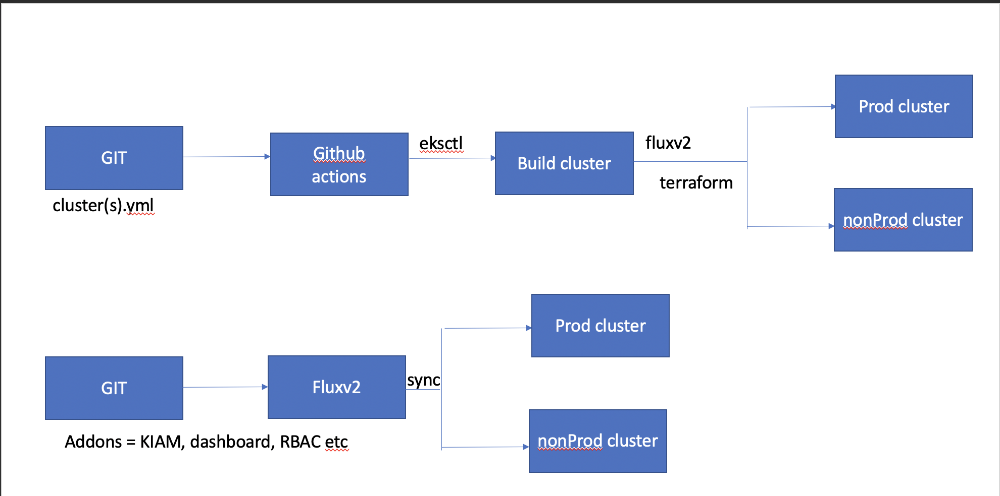

# eks-clusters




1. Create the dev cluster

```eksctl create cluster -f cluster-infra/cluster-dev.yaml```

2. Bootstrap flux on the cluster

https://docs.github.com/en/github/authenticating-to-github/creating-a-personal-access-token

export GITHUB_TOKEN=<your-token>

Make sure kubectl version is 1.16 and above


flux bootstrap github \
  --owner=my-github-username \
  --repository=my-repository \
  --path=clusters/my-cluster \

  flux bootstrap github \
  --owner=dimpledalby07 \
  --repository=eks-clusters-stack \
  --path=flux-addons